# Global Happiness Report Analysis

## Overview
This project processes the `2015.csv` dataset using Python's data science ecosystem (`pandas`, `numpy`, `matplotlib`, and `seaborn`) to perform visual analysis on how different factors like GDP, Family, Health, Freedom, and Government Trust impact a country's overall Happiness Score.

---

Video Explanation : https://drive.google.com/file/d/1WuKIhkcrFSNLyFtjrTyS175vYUC9ttOl/view?usp=sharing

---

## Dataset Details
The dataset `2015.csv` contains the following attributes for 158 countries:

| Column Name | Description |
| :--- | :--- |
| **Country** | Name of the country |
| **Region** | Region the country belongs to |
| **Happiness Rank** | Rank of the country based on its Happiness Score |
| **Happiness Score** | A metric measured by asking people to rate their current lives on a scale of 0 to 10 |
| **Standard Error** | The standard error of the happiness score |
| **Economy (GDP per Capita)** | The extent to which GDP per capita contributes to the Happiness Score |
| **Family** | The extent to which family and social support networks contribute to the Happiness Score |
| **Health (Life Expectancy)** | The extent to which life expectancy contributes to the Happiness Score |
| **Freedom** | The extent to which freedom of choice contributes to the Happiness Score |
| **Trust (Government Corruption)** | The perception of corruption in the government and society |
| **Generosity** | A metric of generosity based on donations and perceptions |
| **Dystopia Residual** | A benchmark representing a hypothetical country with the lowest scores |

---


## Requirements
Make sure you have Python installed, along with the following packages:
```bash
pip install numpy pandas matplotlib seaborn
```

---

## Usage
To execute the visualization script, run the following command in your terminal:
```bash
python fp.py
```
---

## Key Features & Visualizations
The script [`fp.py`](file:///d:/RD/weekly%20task/final%20project/fp.py) performs the following analytical tasks and generates corresponding visualizations:

1. **Dataset Profiling**: Loads and profiles the data (`info()`, `isnull().sum()`).
2. **Correlation Heatmap**: A seaborn heatmap illustrating correlation coefficients between all numerical features.
3. **Top 10 Happiest Countries**: A horizontal bar chart listing the top 10 happiest nations.
4. **Bivariate Scatter Plots**: Individual scatter plots analyzing the relationships between:
   - Economy (GDP per Capita) vs. Happiness Score
   - Family Support vs. Happiness Score
   - Health (Life Expectancy) vs. Happiness Score
   - Freedom vs. Happiness Score
   - Government Trust vs. Happiness Score
5. **Distribution Analysis**: A histogram with a Kernel Density Estimate (KDE) line showing the distribution of happiness scores.
6. **Feature Interaction (Pairplot)**: A matrix of scatter and histogram plots showing relationships across selected variables.
7. **Top 20 Countries by GDP**: A colorful bar plot highlighting economic leaders.
8. **Freedom vs. Happiness Regression**: A regression plot depicting the positive correlation and line of best fit.
9. **GDP Statistical Range**: A boxplot outlining the distribution and spread of GDP per capita.

---

## Code Explanation & Visualizations

Here is a block-by-block breakdown of the code in [`fp.py`] alongside their corresponding visual outputs and analytical insights:

### 1. Library Imports
```python
import numpy as np
import pandas as pd
import matplotlib.pyplot as plt
import seaborn as sns
import os
```
- **Description**: Imports critical packages for the project. `pandas` and `numpy` handle structural manipulation, while `matplotlib.pyplot` and `seaborn` generate the visual plots. `os` is used to create directories.

### 2. Dataset Loading and Inspection
```python
df = pd.read_csv("2015.csv")
df.head()
df.columns
df.info()
df.isnull().sum()
```
- **Description**: Reads the dataset from the CSV file into a Pandas DataFrame and inspects the structural details (data types, shapes, and null counts).

### 3. Correlation Heatmap
```python
corr = df.select_dtypes(include='number').corr()
plt.figure(figsize=(12,8))
sns.heatmap(corr, annot=True, cmap="coolwarm")
plt.title("Correlation Heatmap")
plt.savefig("images/correlation_heatmap.png", bbox_inches='tight', dpi=150)
plt.show()
```
- **Description**: Extracts the numeric features, calculates the correlation matrix, and renders a heatmap to show relationship directions.
- **Output Visualization**:
  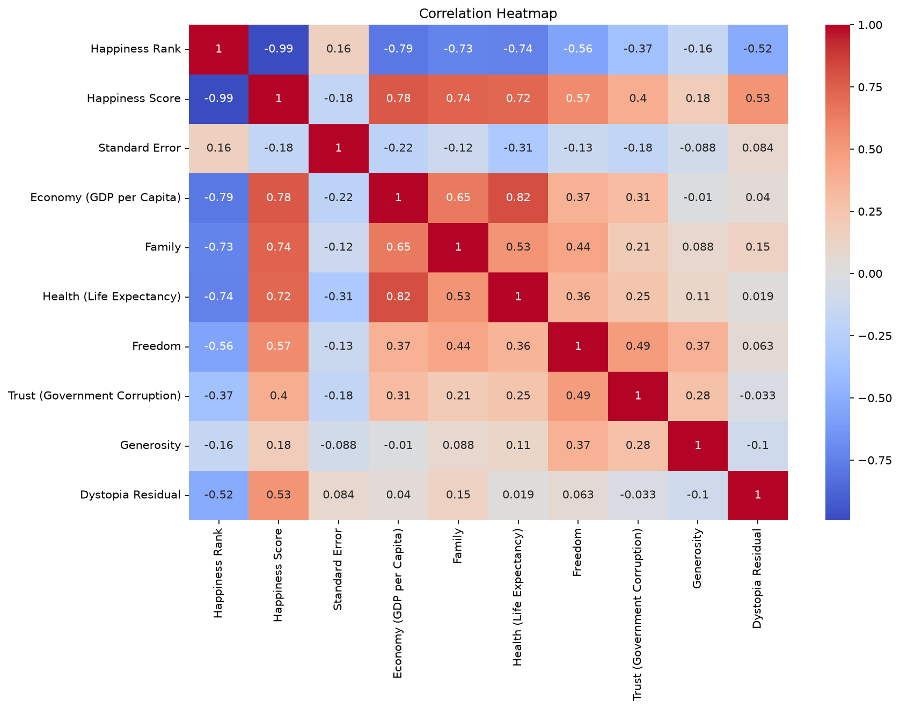
- **Key Insight**: **Economy (GDP per Capita) (0.78)**, **Family (0.74)**, and **Health (0.72)** have the strongest positive correlations with the **Happiness Score**. This indicates that economic prosperity, social support systems, and life expectancy are the most critical factors associated with a nation's happiness.

### 4. Happiest Countries Bar Plot
```python
top10 = df.sort_values("Happiness Score", ascending=False).head(10)
plt.figure(figsize=(10,6))
sns.barplot(data=top10, x = "Happiness Score", y="Country")
plt.title("Happiest Countries")
plt.savefig("images/happiest_countries.png", bbox_inches='tight', dpi=150)
plt.show()
```
- **Description**: Selects the top 10 countries with the highest happiness scores and visualizes them using a horizontal bar plot.
- **Output Visualization**:
  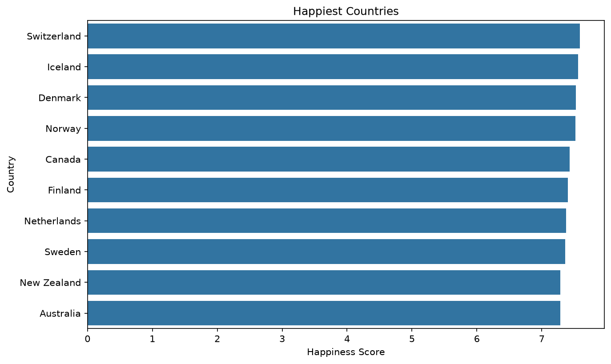
- **Key Insight**: Shows that Switzerland, Iceland, Denmark, Norway, and Canada lead the rankings. These countries consistently score highest due to a combination of high GDP, strong social support structures, and healthy life expectancies.

### 5. Bivariate Scatter Plots (Economy, Family, Health, Freedom, Trust vs. Happiness)
```python
# Economy vs. Happiness Score
plt.figure(figsize=(10,6))
sns.scatterplot(
    data=df,
    x="Economy (GDP per Capita)",
    y="Happiness Score"
)
plt.title("GDP vs Happiness score")
plt.savefig("images/gdp_vs_happiness.png", bbox_inches='tight', dpi=150)
plt.show()
```
- **Description**: Plots the overall Happiness Score against individual predictor variables to visualize general trends.
- **Output Visualizations**:
  - **GDP vs. Happiness**
    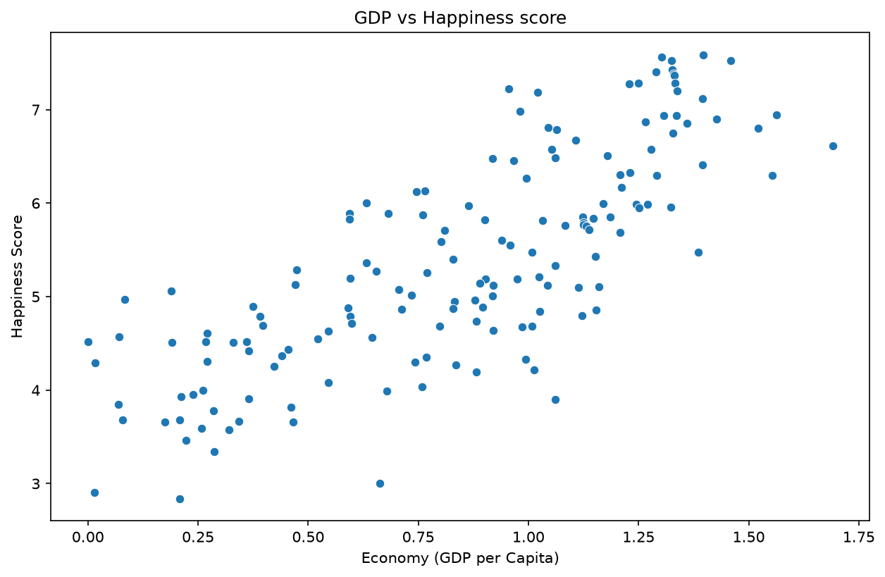
    *Insight*: Shows a very strong, linear upward curve. As a country's economic production increases, life satisfaction rises.
  - **Family vs. Happiness**
    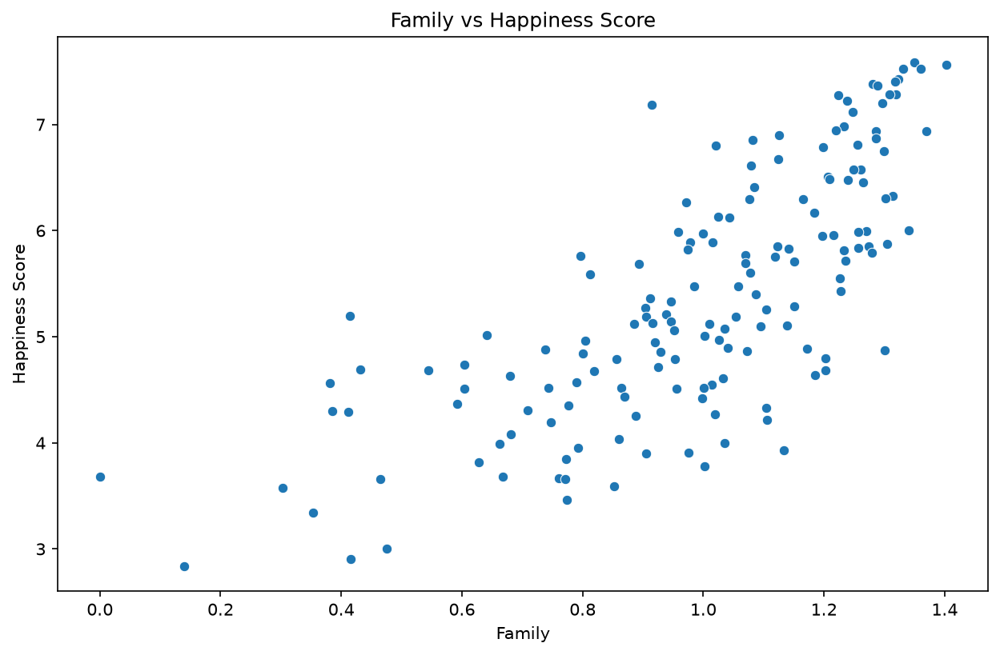
    *Insight*: A strong positive trend showing that high social/community support directly correlates with higher happiness scores.
  - **Health vs. Happiness**
    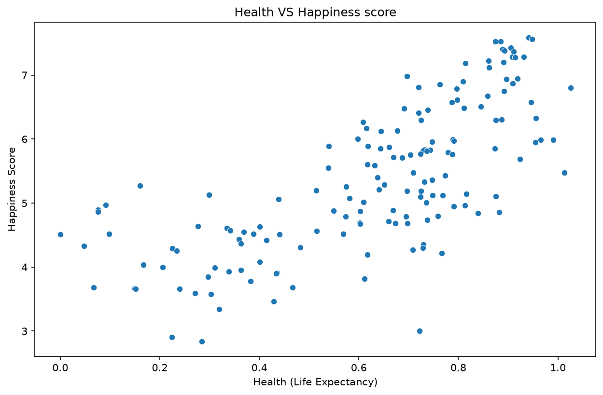
    *Insight*: A strong positive trend showing that longer, healthier life expectancies go hand-in-hand with higher life satisfaction.
  - **Freedom vs. Happiness**
    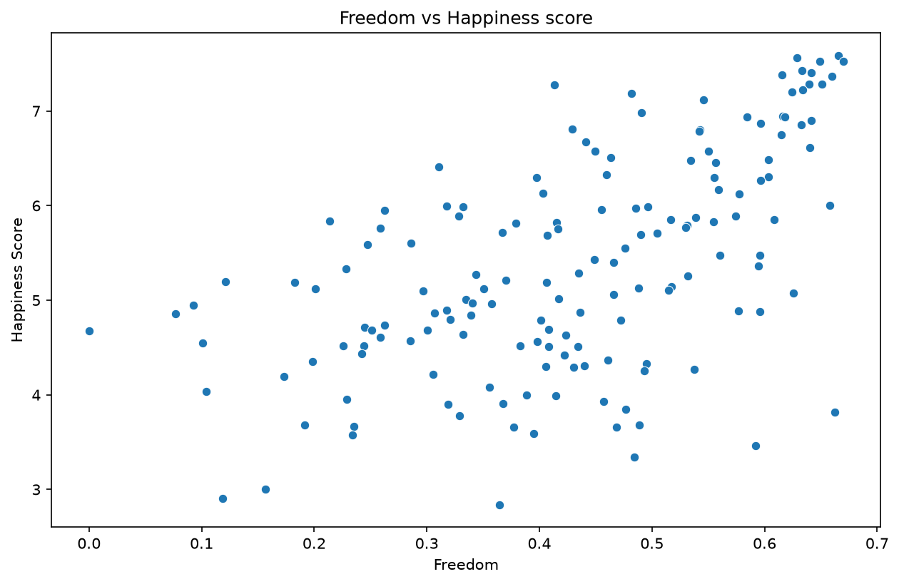
    *Insight*: Shows a moderate-to-strong positive slope, indicating that individual liberty and freedom of choice are important drivers of happiness.
  - **Trust (Corruption) vs. Happiness**
    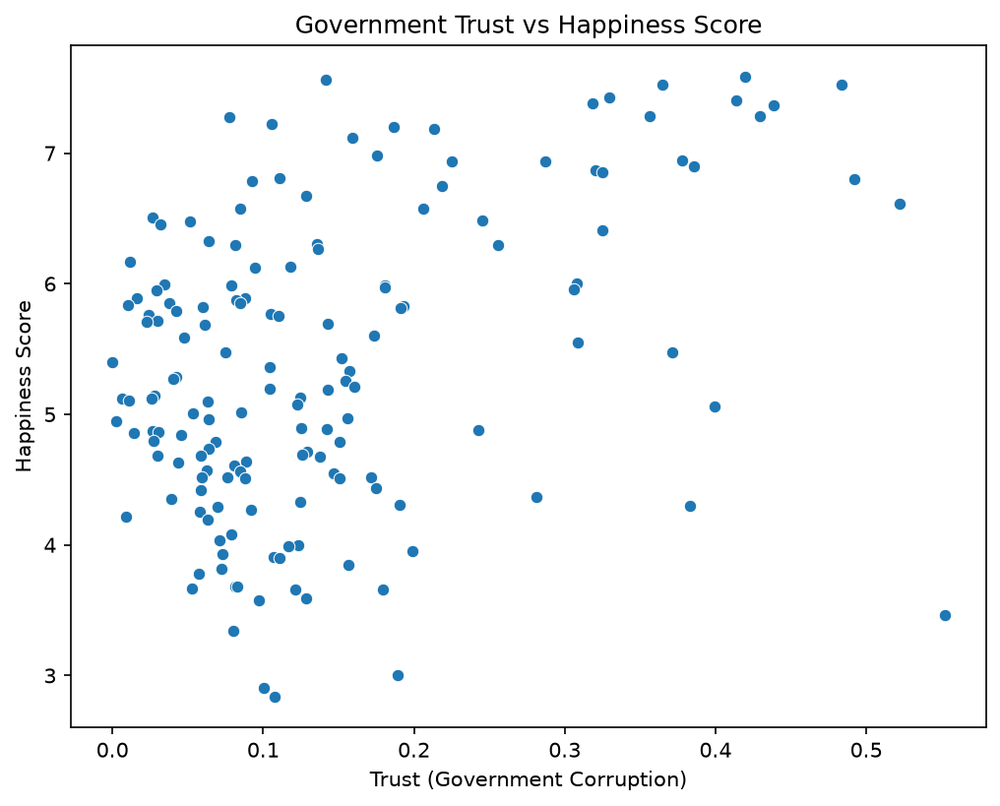
    *Insight*: Most countries cluster at low government trust levels. However, the few countries with very high trust ratings consistently achieve top-tier happiness scores.

### 6. Distribution of Happiness Scores
```python
plt.figure(figsize=(10,6))
sns.histplot(df["Happiness Score"], bins=20, kde=True)
plt.title("Distribution of Happiness Scores")
plt.savefig("images/happiness_distribution.png", bbox_inches='tight', dpi=150)
plt.show()
```
- **Description**: Generates a histogram showing the count frequency of happiness scores across all countries, overlaid with a Kernel Density Estimate (KDE) curve.
- **Output Visualization**:
  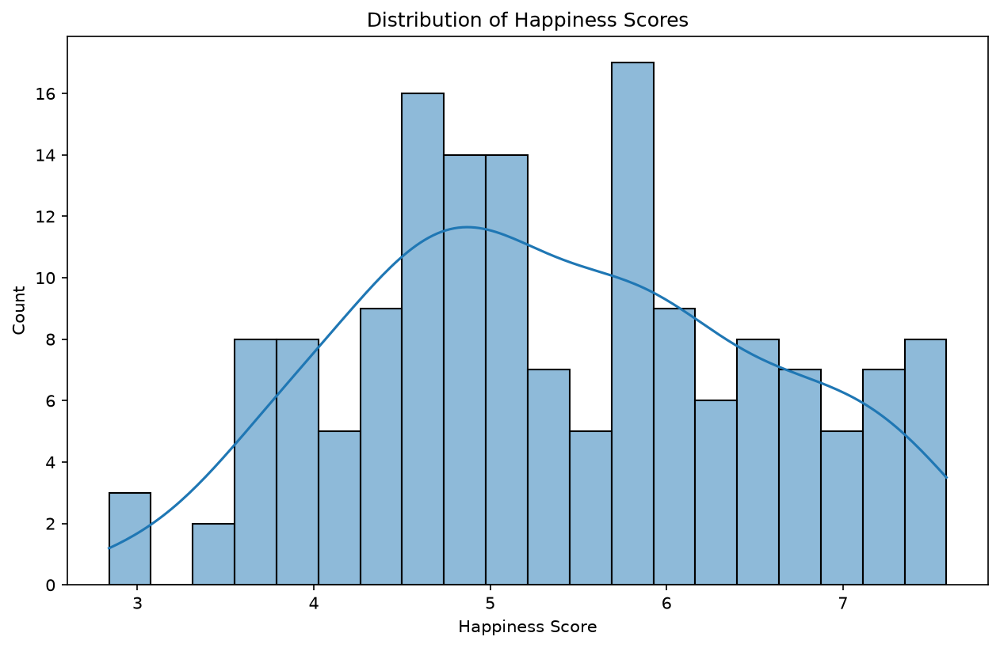
- **Key Insight**: The distribution is roughly symmetrical (bell-shaped) and centered around a mean score of approximately **5.4**. This indicates that the majority of countries fall in the middle-range of happiness, with relatively few extreme outliers.

### 7. Multi-Variable Pairplot Matrix
```python
columns = [
    "Happiness Score",
    "Economy (GDP per Capita)",
    "Family",
    "Health (Life Expectancy)",
    "Freedom"
]
sns.pairplot(df[columns])
plt.savefig("images/pairplot.png", bbox_inches='tight', dpi=150)
plt.show()
```
- **Description**: Generates pairwise plots for the selected main columns. The diagonal shows histograms of individual columns, while the off-diagonal cells display scatter plots of corresponding variable intersections.
- **Output Visualization**:
  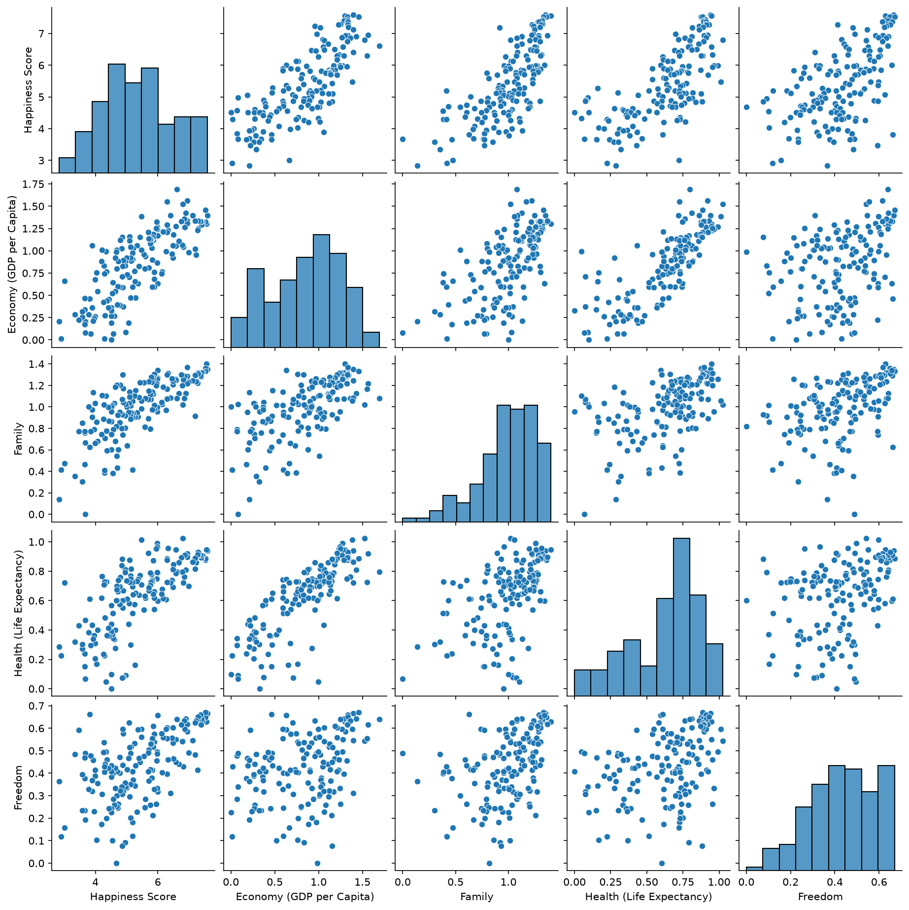
- **Key Insight**: Confirming the individual scatter plots, it reveals tight linear clusters between variables like GDP and Health (indicating richer nations have better healthcare systems), while showing how they collectively feed into the overall Happiness Score.

### 8. Top 20 Countries by GDP per Capita
```python
top_gdp = df.sort_values("Economy (GDP per Capita)", ascending=False).head(20)

plt.figure(figsize=(12,6))
sns.barplot(data=top_gdp,
            x="Economy (GDP per Capita)",
            y="Country",
            palette="viridis")

plt.title("Top 20 Countries by GDP per Capita")
plt.savefig("images/top_20_gdp.png", bbox_inches='tight', dpi=150)
plt.show()
```
- **Description**: Identifies the 20 economically strongest countries based on GDP per Capita and creates a horizontal bar chart with a colored gradient palette.
- **Output Visualization**:
  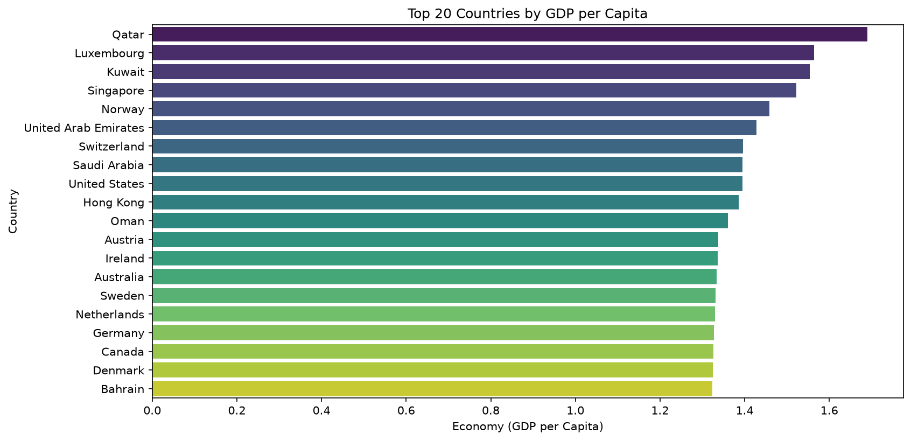
- **Key Insight**: Displays major economic powerhouses (e.g., Qatar, Luxembourg, Singapore) and shows how these nations compare. Notably, high economic power sets a strong baseline for general population happiness.

### 9. Freedom vs. Happiness Score Regression Plot
```python
plt.figure(figsize=(10,6))

sns.regplot(
    data=df,
    x="Freedom",
    y="Happiness Score",
    scatter_kws={"alpha":0.7}
)

plt.title("Freedom vs Happiness Score")
plt.savefig("images/freedom_regression.png", bbox_inches='tight', dpi=150)
plt.show()
```
- **Description**: Fits and plots a linear regression model between Freedom and Happiness Score, showcasing the trend line and the confidence interval of the relationship.
- **Output Visualization**:
  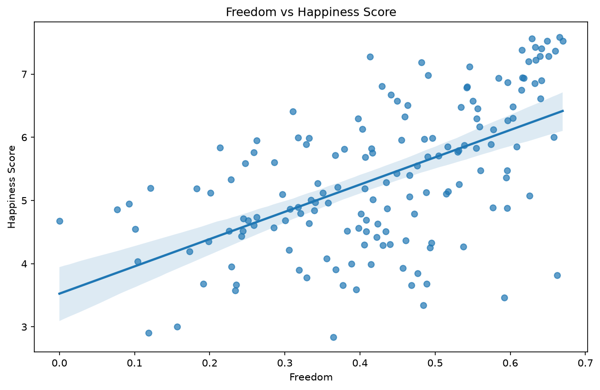
- **Key Insight**: The distinct upward slope confirms a mathematically positive correlation. The shaded band shows the confidence interval of the line of best fit, demonstrating the reliability of the trend.

### 10. Statistical Boxplot of GDP per Capita
```python
plt.figure(figsize=(6,6))

sns.boxplot(
    y=df["Economy (GDP per Capita)"],
    color="orange"
)

plt.title("Boxplot of GDP per Capita")
plt.savefig("images/gdp_boxplot.png", bbox_inches='tight', dpi=150)
plt.show()
```
- **Description**: Renders a vertical box plot of the GDP per capita column to display distribution statistics, showing the median, quartiles, and range.
- **Output Visualization**:
  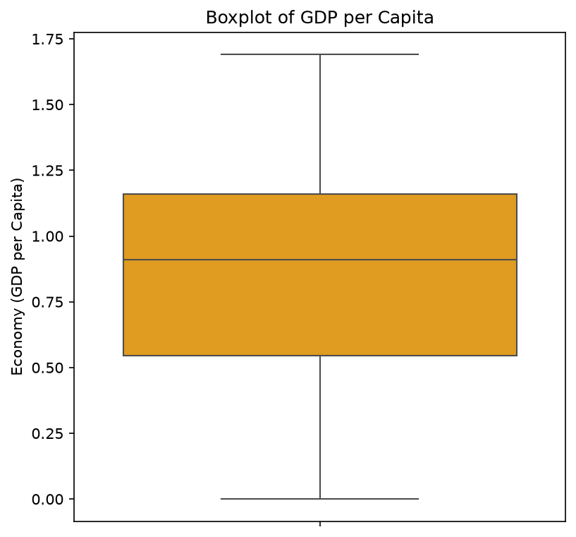
- **Key Insight**: The median contribution of GDP per capita sits around **0.91**. The box extends from approximately 0.54 (25th percentile) to 1.15 (75th percentile), indicating a wide economic gap between the bottom 25% and top 25% of countries.
